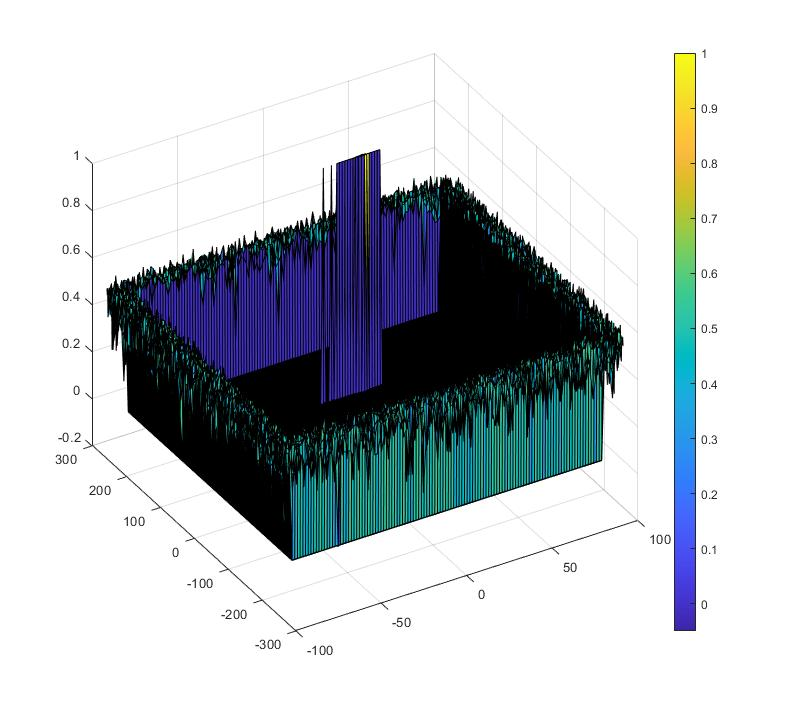
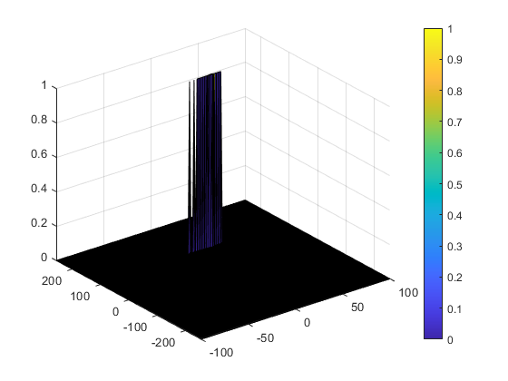

## SFND Radar Target Generation and Detection

Radar Project for Udacity's Sensor Fusion Engineer Nanodegree Program
Final project is implemented in [this file](Radar_Target_Generation_and_Detection.m)

### Writeup

#### Implementation steps for the 2D CFAR process.

1) Determine the training and guard cells
2) iterate throuhg the cell under test(CUT) by leaving gap for the training and gauard cells at the edges
3) sum the noise level(db2pow -  convert the value from logarithmic to linear) based on the training cells around the CUT
4) calculate the threshold by averaging and then convert it back to logarithmic using pow2db
5) add the offset to the threshold
6) set value 1 if the CUT level > threshold or else set to 0

#### Selection of Training, Guard cells and offset.
Cell sizes were selected based on trial and error to find the suitable values

#### Steps taken to suppress the non-thresholded cells at the edges.
As the edges were not considered for the CUT, those values didn't go through the 2D CFAR process (as the training and guard cells will be out of array). So those regions were filtered out by setting hte value to 0.

Without suppressing the non-thresholded cells at the edges

Suppressing the non-thresholded cells at the edges

